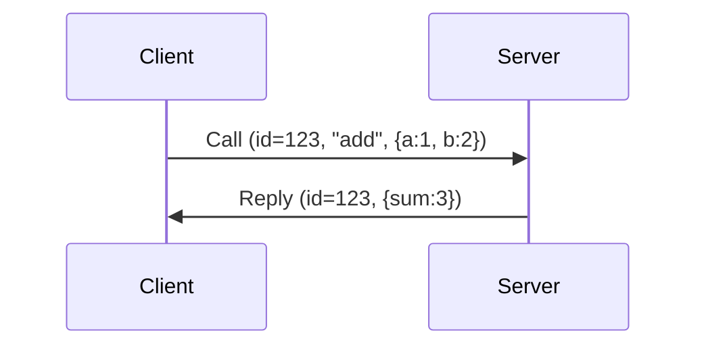
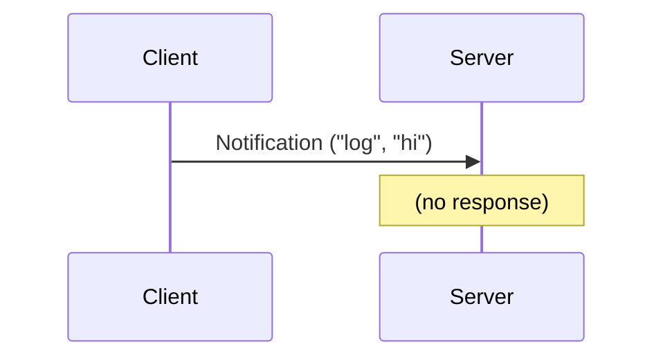
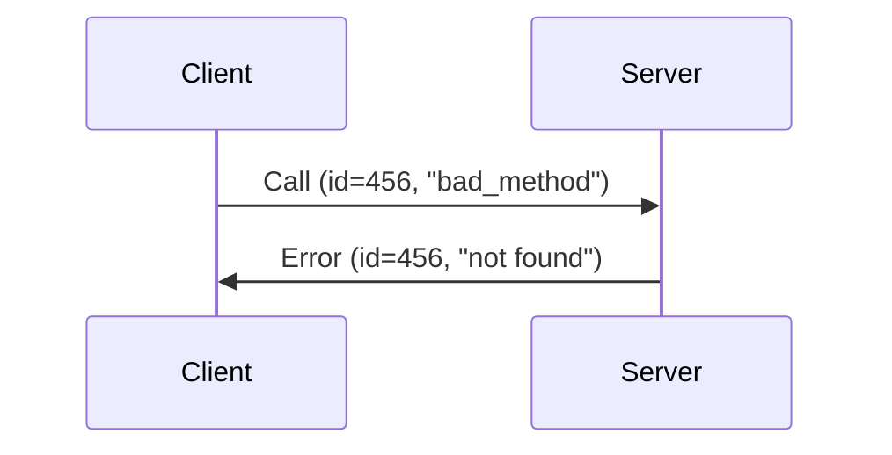

# XRPC Message Protocol 

## Basic Message Structure

```txt
+----------------+
| Magic: "XRPC"  |  4 bytes - protocol
+----------------+
| Version        |  1 byte - current version
+----------------+
| Flags          |  1 byte - flags
+----------------+
| Msg Length     |  4 bytes (u32, little-endian)
+----------------+
| Message ID     |  8 bytes (u64, little-endian) 
+----------------+
| Message Type   |  1 byte - call/reply/notification/error
+----------------+
    |
    v
+-------------------+
| Method len (u16)  |  2 bytes
+-------------------+
| Method name       |  variable UTF-8 string
+-------------------+
    |
    v
+-------------------+
| Payload len (u32) |  4 bytes
+-------------------+
| Payload data      |  variable (bincode for now)
+-------------------+
    |
    v
+-------------------+
| Metadata len      |  4 bytes
+-------------------+
| Metadata          |  variable (bincode)
+-------------------+
```

## Magic Bytes

Using `XRPC` = `[0x58, 0x52, 0x50, 0x43]`

Easy to spot in hex dumps. Version is 1 for now.

## Message Types

```txt
0 = Call        - client calling a method
1 = Reply       - server responding to call
2 = Notification - one-way message (no response)
3 = Error       - error response
```

TODO: Maybe add streaming types later?
- 4 = StreamChunk
- 5 = StreamEnd

## Flags (1 byte)

```
Bit 0 (0x01): compressed
Bit 1 (0x02): streaming (reserved)
Bit 2 (0x04): batch (reserved)
Bits 3-7: unused
```

Currently only checking compressed flag. Others are for future use.

## Field Details

### Header (fixed part)

- Magic: 4 bytes `XRPC`
- Version: 1 byte = `1`
- Flags: 1 byte
- Length: 4 bytes (little-endian u32) - total length AFTER the first 10 bytes
- Message ID: 8 bytes (little-endian u64) - auto-incrementing
- Type: 1 byte (0-3 currently)

Total: 19 bytes minimum header

### Method

- Length: u16 (max 65535)
- Name: UTF-8 string
- Empty for Reply/Error messages

### Payload

- Length: u32
- Data: bincode serialized (using serde)

### Metadata

- Length: u32
- Data: bincode serialized MessageMetadata struct
  - timestamp: u64 (microseconds since epoch)
  - timeout_ms: Option<u32>
  - compression: CompressionType (u8)

## Constants

```rust
MAX_MESSAGE_SIZE = 16 * 1024 * 1024  // 16MB for now. This could be changed.
MIN_HEADER_SIZE = 4 + 1 + 1 + 4 + 8 + 1  // 19 bytes
VERSION = 1
```

## How it works

### Call → Reply flow



IDs match so we know which call this is replying to.

### Notification (fire and forget)



### Error handling


