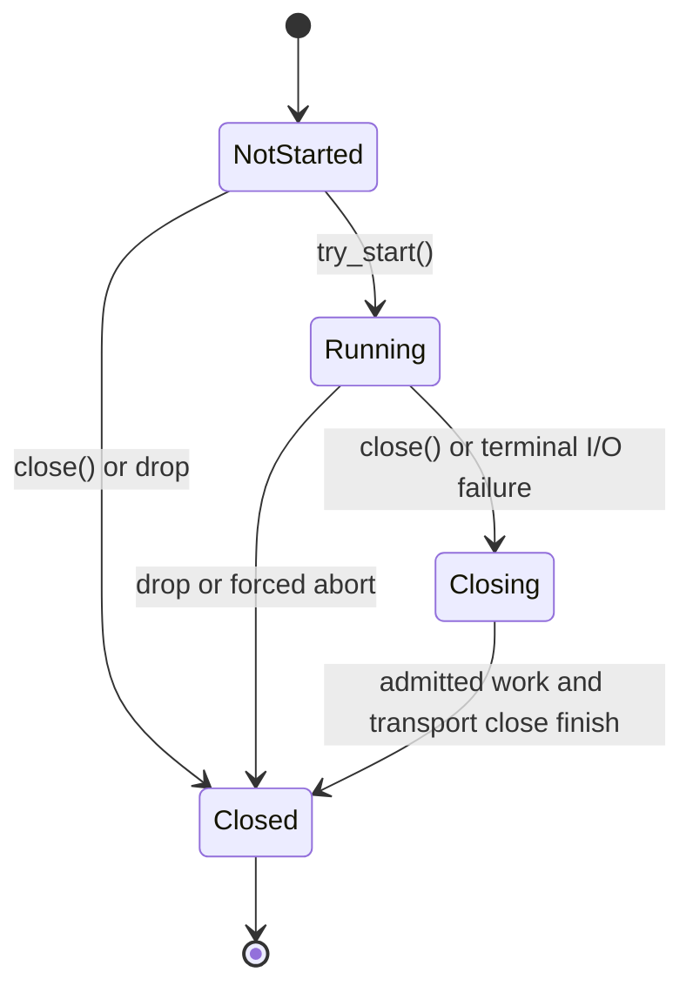

# RPC client lifecycle

An `RpcClient` starts in the not-started state. Calling `try_start()` exactly once is required before making RPCs. It creates the receive loop and returns a handle that owns explicit join and forced-shutdown control.

Retaining the handle is not required for ordinary RPC operation. Dropping it detaches join ownership without stopping the receive loop. Retain it when the application needs to confirm that the receive task has terminated or may need forced shutdown.

## Graceful close

`close()` marks the client terminal before waiting for admission. New work and uncommitted blocked sends fail with `ConnectionClosed` immediately.

A unary or raw RPC whose transport send already returned success is treated as committed. Its admission guard remains active until the response arrives or the call timeout expires, so explicit close cannot report a committed non-idempotent RPC as `ConnectionClosed`. This means graceful close can wait up to the remaining timeout of committed calls.

The complete graceful-close workflow is claimed and spawned before its first admission wait. After admitted work exits, that detached workflow stops the receive loop, completes pending local work, starts transport close exactly once, and stores the result. Cancelling the caller while it is still waiting for admission therefore does not abandon shutdown. Concurrent, cancelled, and later close callers all observe the same stored result.

`close()` completes the graceful close workflow without requiring the public handle. If the handle was retained, call `RpcClientHandle::join()` afterward to confirm that the receive task itself has terminated.

## Receive and send failures

A receive timeout is non-terminal while the transport remains connected. The receive loop continues waiting instead of closing an idle client.

A terminal receive error or terminal outbound send error marks the client closed, cancels uncommitted sends, stops the receive loop, and completes pending calls and streams with the normalized original error. Transport close remains single-flight when explicit close races with either failure path.

The client assumes that `MessageChannel::send()` returning `Ok(())` is the send commit boundary. A channel implementation must not publish data after its pending send future has been cancelled. The built-in SHM transport performs blocking wait/copy as preparation only; it publishes or consumes the ring position synchronously after the blocking result has become ready, with no further await before returning success.

## Forced shutdown and drop

`RpcClientHandle::shutdown()` aborts and joins the receive task. The receive-task finalizer also cancels blocked outbound sends and drains pending calls and streams. Use forced shutdown only when graceful close cannot complete.

Dropping `RpcClient` aborts its receive task through an internally retained abort handle and drains local waiters on a best-effort basis. Drop cannot report transport errors and is not a substitute for explicit `close()`. For strict task-completion confirmation, retain the public handle and follow `close()` with `join()`.

## Streaming

Stream registrations are owned by `StreamReceiver` and are removed on normal `StreamEnd`, stream error, initial send failure, cancellation, client close, or receiver drop.

`StreamSender` serializes chunk sends with `end()`. The ended state is published only after the `StreamEnd` message commits, so a failed or cancelled end can be retried and no later chunk can commit after a successful end.

Load-balanced stream affinity follows the lifetime of `StreamReceiver`, including normal completion, error, cancel, and drop.

## Related documentation

- [Message protocol](./message-protocol.md)
- [Transport shutdown](./transport-shutdown.md)
- [Migrating to 0.3](../migration/0.3.md)
