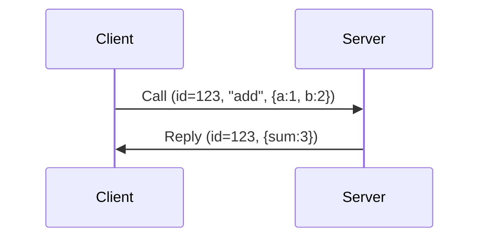
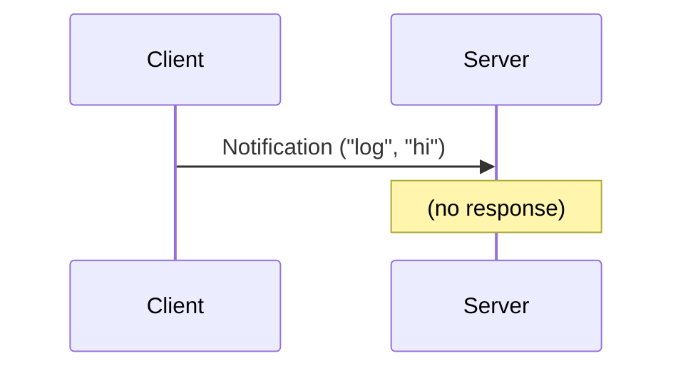
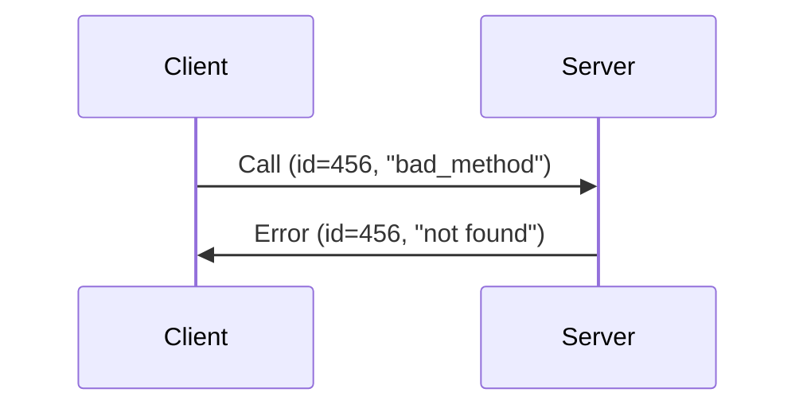
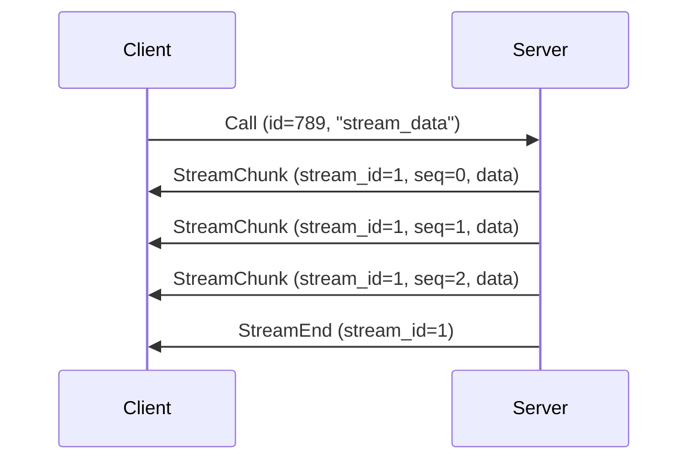

# XRPC Message Protocol

## Basic Message Structure

```txt
+----------------+
| Magic: "XRPC"  |  4 bytes - protocol
+----------------+
| Version        |  1 byte - current version
+----------------+
| Flags          |  1 byte - flags
+----------------+
| Msg Length     |  4 bytes (u32, little-endian; bytes after this field)
+----------------+
| Message ID     |  8 bytes (u64, little-endian)
+----------------+
| Message Type   |  1 byte - call/reply/notification/error/stream
+----------------+
    |
    v
+-------------------+
| Method len (u16)  |  2 bytes
+-------------------+
| Method name       |  variable UTF-8 string
+-------------------+
    |
    v
+-------------------+
| Payload len (u32) |  4 bytes
+-------------------+
| Payload data      |  variable (configured payload codec; optionally compressed)
+-------------------+
    |
    v
+-------------------+
| Metadata len      |  4 bytes
+-------------------+
| Metadata          |  variable (bincode)
+-------------------+
```

## Magic Bytes

Using `XRPC` = `[0x58, 0x52, 0x50, 0x43]`

Easy to spot in hex dumps. Version is 1 for now.

## Message Types

```txt
0 = Call         - client calling a method
1 = Reply        - server responding to call
2 = Notification - one-way message (no response)
3 = Error        - error response
4 = StreamChunk  - streaming data chunk
5 = StreamEnd    - end of stream
```

## Flags (1 byte)

```txt
Bit 0 (0x01): compressed
Bit 1 (0x02): streaming
Bit 2 (0x04): batch (reserved)
Bits 3-7: unused
```

- **compressed**: Set when payload is compressed
- **streaming**: Set for streaming messages
- **batch**: Reserved for batch operations (future use)

## Field Details

### Header (fixed part)

- Magic: 4 bytes `XRPC`
- Version: 1 byte = `1`
- Flags: 1 byte
- Length: 4 bytes (little-endian u32) - exact number of bytes after the first 10 bytes
- Message ID: 8 bytes (little-endian u64) - auto-incrementing
- Type: 1 byte (0-5)

The prefix through `Message Type` is 19 bytes. Including the three variable-field
lengths (`Method`, `Payload`, and `Metadata`), every message has 29 bytes of fixed
structural overhead. `MIN_HEADER_SIZE` refers to this complete 29-byte minimum.

### Method

- Length: u16 (max 65535)
- Name: UTF-8 string
- Empty for Reply/Error/Stream messages

### Payload

- Length: u32
- Data: serialized by the configured `Codec` using Serde
- `BincodeCodec` is the default. `JsonCodec` is built in, while MessagePack,
  CBOR, and Postcard are available through crate features.
- The codec is not identified in the frame, so both endpoints must use compatible
  codec configuration.

### Metadata

- Length: u32
- Data: bincode serialized MessageMetadata struct
  - timestamp: u64 (microseconds since epoch)
  - timeout_ms: Option<u32>
  - compression: `CompressionType` enum (`None`, `Lz4`, or `Zstd`)
  - stream_id: Option<u64>
  - sequence_number: Option<u64>

## Constants

```rust
MAX_MESSAGE_SIZE = 16 * 1024 * 1024  // 16MB for now. This could be changed.
MIN_HEADER_SIZE = 4 + 1 + 1 + 4 + 8 + 1 + 2 + 4 + 4  // 29 bytes
VERSION = 1
```

The encoder includes every fixed-width length field in both `Msg Length` and the
16 MiB size limit. The decoder verifies the declared frame length and checks the
remaining bytes before reading each variable-length field, returning
`TransportError::Protocol` for malformed or truncated input.

For compatibility with xrpc-rs 0.2.x, the decoder also accepts the legacy length
value that was exactly 10 bytes too small because it omitted the three
variable-field length words. New messages are always encoded with the exact length.

## How it works

### Call → Reply flow



IDs match so we know which call this is replying to.

### Notification (fire and forget)



### Error handling



### Streaming



## Features

### Streaming Support

Streaming is always available in the protocol.

API:

- `Message::stream_chunk(stream_id, sequence, data)` - Create stream chunk
- `Message::stream_end(stream_id)` - Signal end of stream

Metadata fields:

- `stream_id: Option<u64>` - Identifies the stream
- `sequence_number: Option<u64>` - Ensures ordered delivery

### Compression Support

Available compression types:

- `CompressionType::None` - No compression (default)
- `CompressionType::Lz4` - LZ4 compression (fast, good ratio)
- `CompressionType::Zstd` - Zstandard compression (better ratio, slightly slower)

Compression is always available. Choose the compression type at runtime by setting the metadata:

```rust
let mut msg = Message::call("method", data)?;
msg.metadata.compression = CompressionType::Lz4;
```

## Related documentation

- [Client lifecycle](./client-lifecycle.md)
- [Transport shutdown](./transport-shutdown.md)
- [Migrating to 0.3](../migration/0.3.md)
